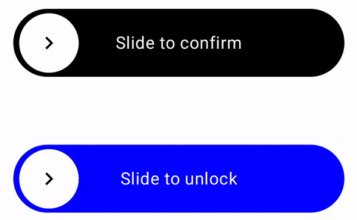

# PUBLISHING IS WIP, I WILL NOTIFY WHEN AVAILABLE

# SlideView

SlideView is a highly customizable UI component for Jetpack Compose that allows you to create slide-to-trigger actions in your Android apps. It's perfect for implementing features like slide-to-unlock or slide-to-confirm actions.

<p align="center">
  
</p>

## Features

- **Customizable:** Easily modify the appearance and behavior.
- **Jetpack Compose:** Built with modern Android UI toolkit.
- **Lightweight:** Minimal dependencies for easy integration.

## Installation

Add the following to your `build.gradle.kts`:

```kotlin
dependencies {
    implementation("com.example:slideview:1.0.0")
}
```

## Usage
Here's a basic example:
```kotlin
SlideView(
    onSlideComplete = { /* Your action here */ },
    modifier = Modifier.fillMaxWidth()
)
```

## License
This project is licensed under the MIT License - see the LICENSE file for details.
